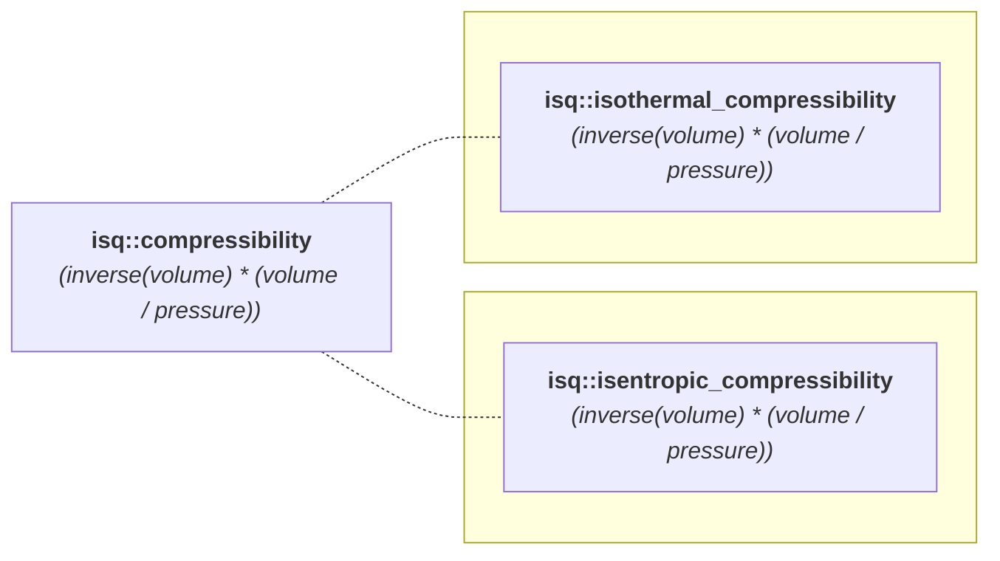

<!-- This file is auto-generated. Do not edit manually. -->
<!-- Run: python3 scripts/systems_reference.py --force -->

# compressibility Hierarchy

**System:** ISQ

**Legend:**

- Subgraphs with a dotted line from the parent indicate a distinct quantity kind (created with `is_kind`). These subtrees are type-isolated: quantities inside cannot be added or compared to those outside their subgraph without explicit conversion.
