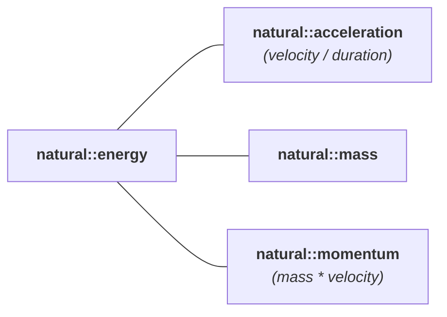

<!-- This file is auto-generated. Do not edit manually. -->
<!-- Run: python3 scripts/systems_reference.py --force -->

# energy Hierarchy

**System:** Natural

**Dimension:** dim_energy

```mermaid
flowchart LR
    natural_energy["<b><a href="../../systems/natural/#energy" style="color: var(--md-mermaid-label-fg-color); text-decoration: none;">natural::energy</a></b>"]
    natural_acceleration["<b><a href="../../systems/natural/#acceleration" style="color: var(--md-mermaid-label-fg-color); text-decoration: none;">natural::acceleration</a></b><br><i>(<a href="../../systems/natural/#velocity" style="color: var(--md-mermaid-label-fg-color); text-decoration: none;">velocity</a> / <a href="../../systems/natural/#duration" style="color: var(--md-mermaid-label-fg-color); text-decoration: none;">duration</a>)</i>"]
    natural_energy --- natural_acceleration
    natural_mass["<b><a href="../../systems/natural/#mass" style="color: var(--md-mermaid-label-fg-color); text-decoration: none;">natural::mass</a></b>"]
    natural_energy --- natural_mass
    natural_momentum["<b><a href="../../systems/natural/#momentum" style="color: var(--md-mermaid-label-fg-color); text-decoration: none;">natural::momentum</a></b><br><i>(<a href="../../systems/natural/#mass" style="color: var(--md-mermaid-label-fg-color); text-decoration: none;">mass</a> * <a href="../../systems/natural/#velocity" style="color: var(--md-mermaid-label-fg-color); text-decoration: none;">velocity</a>)</i>"]
    natural_energy --- natural_momentum
```
